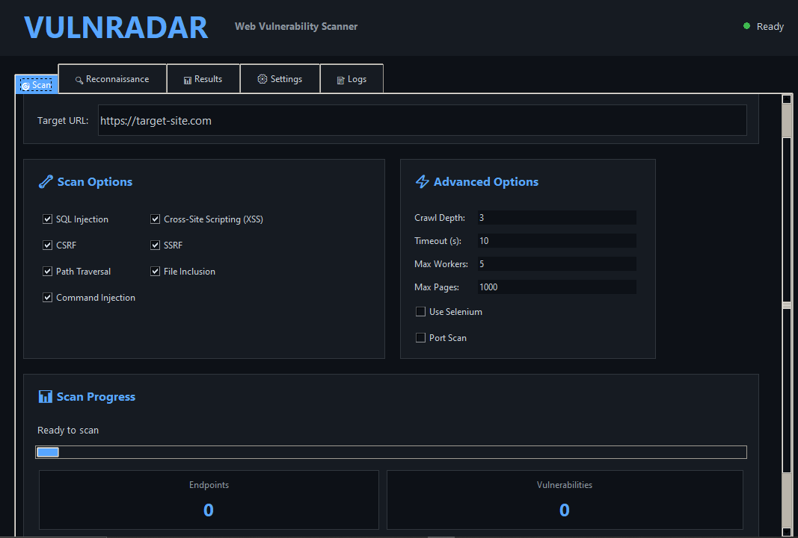

<div align="center">
  
</div>

# `VulnRadar` - A Web Vulnerability Scanner

[](https://www.python.org/downloads/)
[](LICENSE)
[](https://github.com/MykeChidi/vulnradar/issues)

A comprehensive, asynchronous web vulnerability scanner designed to identify common security flaws in web applications. VulnRadar combines intelligent web crawling, advanced reconnaissance, and targeted vulnerability testing with detailed reporting capabilities.

## Quick Start

```bash
# Install dependencies
pip install -r requirements.txt

# Basic scan
python -m vulnradar https://example.com

# Run with GUI
python -m vulnradar --gui
```

## Features

### 🔍 Reconnaissance & Discovery
- **DNS Enumeration** - A, MX, NS, TXT record lookups
- **Port Scanning** - Configurable port ranges with service detection
- **WAF Detection** - Identify Web Application Firewalls
- **Technology Stack Detection** - Detect frameworks, servers, and libraries
- **Advanced Recon Modules**:
  - Network Infrastructure Analysis
  - Security Infrastructure Analysis  
  - Web Application Analysis
  - Infrastructure Relationship Mapping
  - Miscellaneous Analysis

### 🕷️ Web Crawling
- Intelligent crawling with configurable depth
- JavaScript rendering support via Selenium
- Endpoint discovery and URL mapping
- Configurable page limits
- Cookie and custom header support

### 🛡️ Vulnerability Detection
- **SQL Injection (SQLi)** - Database injection detection
- **Cross-Site Scripting (XSS)** - Reflected and DOM-based XSS
- **Cross-Site Request Forgery (CSRF)** - CSRF token detection
- **Server-Side Request Forgery (SSRF)** - SSRF vulnerability detection
- **Path Traversal** - Directory traversal and path-based attacks
- **File Inclusion** - LFI and RFI detection
- **Command Injection** - OS command injection detection

### 📊 Reporting
- **HTML Reports** - Interactive, detailed findings
- **PDF Reports** - Professional printable format
- **JSON Export** - Machine-readable format for automation
- **Excel Reports** - Spreadsheet with vulnerability details
- **SQLite Database** - Persistent storage for scan results

### ⚙️ Performance & Configuration
- Asynchronous scanning for speed
- Configurable concurrency (worker threads)
- Request timeout control
- Caching system for result optimization
- Database storage option

### 🎯 Multi-Target Scanning
- Scan multiple targets from a single YAML configuration file
- Per-target configuration (timeout, retries, scan options)
- Concurrent or sequential scanning modes
- Aggregated reporting across all targets
- Individual target result files

### 🖥️ User Interfaces
- **Command-Line Interface (CLI)** - Full automation support
- **Graphical User Interface (GUI)** - Tkinter-based GUI

<div align="center">
  
</div>

## Installation

### Requirements
- Python 3.10+
- pip package manager
- Git (optional, for cloning the repository)

### Quick Installation

```bash
# Clone the repository
git clone https://github.com/MykeChidi/vulnradar.git

# Create virtual environment
python -m venv venv
source venv/bin/activate  # On Windows: venv\Scripts\activate

# Install dependencies
pip install -r requirements.txt

# Verify installation
python -m vulnradar --help
```

For detailed setup instructions, see [Installation Guide](docs/INSTALLATION.md).

## Basic Usage

### Simple Scan
```bash
python -m vulnradar https://example.com
```

### With Custom Options
```bash
python -m vulnradar https://example.com \
    --crawl-depth 4 \
    --max-workers 8 \
    --timeout 20 \
    --output-dir ./results
```

### Reconnaissance Only
```bash
python -m vulnradar https://example.com --recon-only --recon-all
```

### Authenticated Scanning
```bash
python -m vulnradar https://app.example.com \
    --cookies "session=abc123;auth=xyz789"
```

### Multi-Target Scanning
```bash
# Generate configuration template
python -m vulnradar --show-multi-config

# Scan multiple targets from YAML config
python -m vulnradar --targets-file multi_target_config.yaml
```

### Database Storage
```bash
python -m vulnradar https://example.com \
    --use-db \
    --db-path ./scans.db
```

## Documentation

Complete documentation for all use cases:

### **For New Users**
- **📋 [Installation Guide](docs/INSTALLATION.md)** - Detailed setup instructions
- **🚀 [Getting Started](docs/GETTING_STARTED.md)** - First scan walkthrough
- **📖 [Usage Guide](docs/USAGE.md)** - Complete CLI reference
- **⚙️ [Configuration](docs/CONFIGURATION.md)** - Configuration options reference
- **🎯 [Multi-Target Scanning](docs/MULTI_TARGET.md)** - Multi-target configuration and usage

### **Troubleshooting**
- **❓ [Troubleshooting](docs/TROUBLESHOOTING.md)** - Common issues and solutions

### **Security**
- **🔒 [Security Guide](docs/SECURITY.md)** - Legal and security considerations

## System Requirements

| Component | Requirement |
|-----------|------------|
| Python | 3.10 or higher |
| OS | Windows, macOS, Linux |
| Memory | 512 MB minimum, 2+ GB recommended |
| Disk | 300 MB for installation |
| Network | Active internet connection |

### Optional Dependencies
- **Selenium** - For JavaScript rendering (slower but more thorough)
- **Nmap** - For advanced port scanning (requires separate installation)

## Key Options

| Option | Purpose | Default |
|--------|---------|---------|
| `--crawl-depth` | How deep to crawl the site | 3 |
| `--max-workers` | Number of concurrent requests | 5 |
| `--timeout` | Request timeout (seconds) | 10 |
| `--use-selenium` | Enable JavaScript rendering | Disabled |
| `--port-scan` | Perform port scanning | Disabled |
| `--use-db` | Store results in database | Disabled |
| `--cache-dir` | Cache directory path | cache |

## License

This project is licensed under the **GNU Affero General Public License v3.0** - see [LICENSE](LICENSE) file for details.

### Key License Terms
- ✅ Free to use, modify, and distribute
- ⚠️ Must include license notice
- ⚠️ Source code modifications must be shared
- ⚠️ Network use is treated as distribution (AGPL specific)
- ⚠️ No warranty provided

## Support & Issues

- **Documentation**: See [docs/](docs/) directory
- **Bug Reports**: [GitHub Issues](https://github.com/MykeChidi/vulnradar/issues)
- **Questions**: Create a discussion or check existing issues

## Security & Legal

⚠️ **IMPORTANT**: VulnRadar is for authorized security testing only. Unauthorized access to computer systems is illegal. Ensure you have explicit written permission before scanning any website or application.

For detailed security information, see [Security Guide](docs/SECURITY.md).

## Disclaimer

This tool is provided "as is" for educational and authorized security testing purposes. Users are solely responsible for ensuring they have proper authorization before using this tool. The developers assume no liability for misuse or damage caused by this tool.

---

**VulnRadar** - Making web application security testing accessible and automated.
- *Copyright (c) 2026 MykeChidi.*