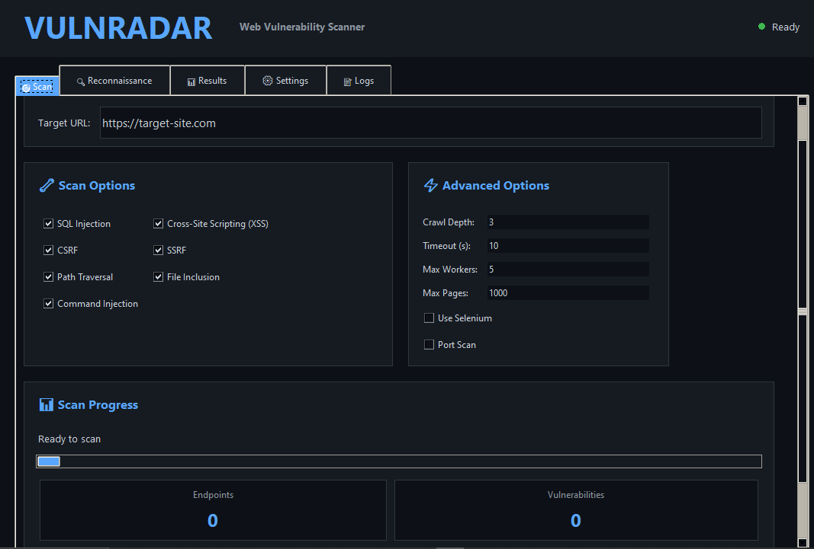

<div align="center">
  
  <h1> VulnRadar </h1>
  <h3> A Web Vulnerability Scanner </h3>
</div>


[](https://www.python.org/downloads/)
[](LICENSE)
[](https://github.com/MykeChidi/vulnradar/issues)
[](https://github.com/PyCQA/bandit)

A comprehensive, asynchronous web vulnerability scanner designed to identify common security flaws in web applications. VulnRadar combines intelligent web crawling, advanced reconnaissance, and targeted vulnerability testing with detailed reporting capabilities.

## Quick Start

```bash
# Install dependencies
pip install -r requirements.txt

# Basic scan
python -m vulnradar https://example.com

# Run with GUI
python -m vulnradar --gui
```

## Features

### 🔍 Reconnaissance & Discovery (5 Specialized Modules)

#### Network Infrastructure Analysis
- DNS enumeration (A, MX, NS, TXT, SOA records)
- Advanced port scanning with nmap integration
- WAF/firewall detection (wafw00f integration)
- Load balancer detection
- Service detection on open ports
- OS fingerprinting
- SSL/TLS certificate analysis

#### Security Infrastructure Analysis
- SSL/TLS configuration validation
- Security header analysis (CSP, HSTS, X-Frame-Options, etc.)
- DNSSEC validation
- Email security (SPF, DKIM, DMARC records)
- Subdomain enumeration
- WHOIS data collection

#### Web Application Analysis
- Technology/framework detection (50+ signatures)
- Server and library detection
- Content discovery
- Sitemap parsing
- JavaScript library detection
- Server banner extraction

#### Infrastructure Relationship Mapping
- Cross-module data correlation
- Attack surface mapping
- Relationship graph building
- Cloud infrastructure detection

#### Miscellaneous Analysis
- Error code analysis and patterns
- Cache configuration detection
- Debug mode detection
- Development artifacts discovery
- Backend service identification

### 🕷️ Web Crawling
- Intelligent crawling with configurable depth
- JavaScript rendering support via Selenium
- Endpoint discovery and URL mapping
- Configurable page limits
- Cookie and custom header support

### 🛡️ Vulnerability Detection (25+ Specialized Scanners)

#### Core OWASP Top 10 Vulnerabilities
- **SQL Injection (SQLi)** - Database injection detection with payload variation
- **Cross-Site Scripting (XSS)** - Reflected and DOM-based XSS detection
- **Cross-Site Request Forgery (CSRF)** - CSRF token detection and validation bypass
- **Server-Side Request Forgery (SSRF)** - SSRF vulnerability detection
- **Path Traversal** - Directory traversal and path-based attacks
- **File Inclusion** - LFI and RFI detection
- **Command Injection** - OS command injection detection
- **Broken Authentication** - Authentication bypass and weakness detection
- **Insecure Direct Object Reference (IDOR)** - Access control bypass detection
- **Security Misconfiguration** - Security header and config analysis

#### Advanced Vulnerability Scanners
- **JWT Security** - JWT token validation, algorithm weakness, sensitive data leakage
- **CORS Misconfiguration** - Origin reflection, credential handling, wildcard policy detection
- **Server-Side Template Injection (SSTI)** - Template expression evaluation
- **XML External Entity (XXE)** - External entity processing and DTD attacks
- **NoSQL Injection** - Document-based database injection patterns
- **LDAP Injection** - LDAP query manipulation detection
- **Insecure Deserialization** - Object deserialization exploit detection
- **Mass Assignment** - Bulk parameter injection detection
- **API Security** - API endpoint analysis and permission testing
- **Open Redirect** - Unvalidated redirect detection
- **Contextual Vulnerabilities** - Context-aware, ID-based vulnerability detection

### 📊 Multi-Format Reporting & Analysis
- **HTML Reports** - Interactive, detailed findings with Jinja2 templates
- **JSON Export** - Machine-readable format for automation and CI/CD integration
- **PDF Reports** - Professional, printable format (ReportLab)
- **Excel/CSV Export** - Spreadsheet format via pandas for data analysis
- **Report Features**:
  - Finding severity visualization and statistics
  - Endpoint mapping and technology stack reporting
  - Evidence with payload details and proof of vulnerability
  - Remediation guidance and best practices
  - CVSS scores, CWE mappings, and OWASP category classification
  - Confidence scores for each finding

### 💾 Persistent Storage & Advanced Caching

#### Database Storage
- **SQLite Database Integration** - Persistent vulnerability storage with sqlalchemy ORM
- **Indexed Queries** - Fast retrieval by target, vulnerability type, severity
- **Session Management** - Connection pooling for efficient database access
- **Thread-Safe Access** - Concurrent scanning with safe database operations
- **Automatic Schema Creation** - First-run initialization

#### Intelligent Caching System
- **Secure Encryption** - Fernet encryption with PBKDF2 key derivation
- **LRU Eviction** - 1000 entry memory limit with access-based automatic eviction
- **Entry-Level TTL** - Configurable expiration per cache entry
- **HMAC Integrity** - Message authentication for cached data
- **Deserialization Protection** - Max depth limits prevent attack vectors
- **Per-Analyzer Caches** - Separate caches for network, security, and webapp recon
- **Optional Disk Persistence** - Filesystem cache for long-term storage

### ⚙️ Advanced Architecture & Performance

#### Asynchronous Scanning
- **Async/Await Throughout** - All I/O is non-blocking for maximum efficiency
- **Shared Execution Context** - Single session per scan, shared across all scanners
- **Concurrency Control** - `asyncio.Semaphore` for precise thread management
- **Configurable Workers** - 1-50 concurrent threads for optimal performance tuning
- **Connection Pooling** - Efficient resource management and QueuePool for databases

#### Advanced Scanner Types
- **Stateful Scanners** - Maintain persistent sessions for multi-step flows (login, token validation)
- **Contextual Scanners** - Analyze URL patterns for ID-based vulnerabilities (IDOR, Mass Assignment)
- **Registry-Driven Architecture** - Plugin system for easy scanner extension

#### Performance Optimization
- **Response Size Limits** - 5MB hard cap per response to prevent memory issues
- **Compiled Regex Patterns** - Pre-compiled for maximum detector performance
- **Adaptive Rate Limiting** - Automatically adjusts based on server responses
- **Memory Management** - Cache entry size caps and LRU eviction
- **Intelligent Payload Filtering** - Smart duplicate and invalid payload detection

### 🎯 Multi-Target Scanning
- Scan multiple targets from a single YAML configuration file
- Per-target configuration (timeout, retries, scan options)
- Concurrent or sequential scanning modes
- Aggregated reporting across all targets
- Individual target result files

### 🖥️ User Interfaces & Utilities

#### Command-Line Interface (CLI)
- Full automation support with comprehensive options
- YAML-based multi-target configuration
- Environment variable support
- Real-time output and progress reporting
- Exit codes for CI/CD integration

#### Graphical User Interface (GUI)
- **Tkinter-Based Interface** - Modern, responsive user experience
- **Multi-Threaded Scanning** - Non-blocking UI during scans
- **Real-Time Output Display** - Live progress and finding updates
- **Tabbed Results Organization** - Organized vulnerability display
- **File Dialog Integration** - Easy result export and import

#### Advanced Utilities
- **Error Handling System** - Custom exception hierarchy with error deduplication
- **Input Validation** - URL, cookie, header validation with RFC compliance
- **Rate Limiting** - Adaptive rate limiter with per-endpoint tracking
- **Structured Logging** - File and console logging with rotation
- **Standards Mapping** - CVSS scores, CWE IDs, OWASP categories per vulnerability

<div align="center">
  
</div>

## Installation

### Requirements
- Python 3.10+
- pip package manager
- Git (optional, for cloning the repository)

### Quick Installation

```bash
# Clone the repository
git clone https://github.com/MykeChidi/vulnradar.git
cd vulnradar

# Create virtual environment
python -m venv venv
source venv/bin/activate  # On Windows: venv\Scripts\activate

# Install dependencies
pip install -r requirements.txt

# Verify installation
python -m vulnradar --help
```

For detailed setup instructions, see [Installation Guide](docs/INSTALLATION.md).

## Basic Usage

### Simple Scan
```bash
python -m vulnradar https://example.com
```

### With Custom Options
```bash
python -m vulnradar https://example.com \
    --crawl-depth 4 \
    --max-workers 8 \
    --timeout 20 \
    --output-dir ./results
```

### Reconnaissance Only
```bash
python -m vulnradar https://example.com --recon-only --recon-all
```

### Authenticated Scanning
```bash
python -m vulnradar https://app.example.com \
    --cookies "session=abc123;auth=xyz789"
```

### Multi-Target Scanning
```bash
# Generate configuration template
python -m vulnradar --show-multi-config

# Scan multiple targets from YAML config
python -m vulnradar --targets-file multi_target_config.yaml
```

### Database Storage
```bash
python -m vulnradar https://example.com \
    --use-db \
    --db-path ./scans.db
```

## Documentation

Complete documentation for all use cases:

### **For New Users**
- **📋 [Installation Guide](docs/INSTALLATION.md)** - Detailed setup instructions
- **🚀 [Getting Started](docs/GETTING_STARTED.md)** - First scan walkthrough
- **📖 [Usage Guide](docs/USAGE.md)** - Complete CLI reference
- **⚙️ [Configuration](docs/CONFIGURATION.md)** - Configuration options reference
- **🎯 [Multi-Target Scanning](docs/MULTI_TARGET.md)** - Multi-target configuration and usage

### **Troubleshooting**
- **❓ [Troubleshooting](docs/TROUBLESHOOTING.md)** - Common issues and solutions

### **Security**
- **🔒 [Security Guide](docs/SECURITY.md)** - Legal and security considerations

## System Requirements

| Component | Requirement |
|-----------|------------|
| Python | 3.10 or higher |
| OS | Windows, macOS, Linux |
| Memory | 512 MB minimum, 2+ GB recommended |
| Disk | 300 MB for installation |
| Network | Active internet connection |

### Optional Dependencies
- **Selenium** - For JavaScript rendering (slower but more thorough)
- **Nmap** - For advanced port scanning (requires separate installation)

## Key Options

| Option | Purpose | Default |
|--------|---------|---------|
| `--crawl-depth` | How deep to crawl the site | 3 |
| `--max-workers` | Number of concurrent requests | 5 |
| `--timeout` | Request timeout (seconds) | 10 |
| `--use-selenium` | Enable JavaScript rendering | Disabled |
| `--port-scan` | Perform port scanning | Disabled |
| `--use-db` | Store results in database | Disabled |
| `--cache-dir` | Cache directory path | vulnradar_cache |

## License

This project is licensed under the **GNU Affero General Public License v3.0** - see [LICENSE](LICENSE) file for details.

### Key License Terms
- ✅ Free to use, modify, and distribute
- ⚠️ Must include license notice
- ⚠️ Source code modifications must be shared
- ⚠️ Network use is treated as distribution (AGPL specific)
- ⚠️ No warranty provided

## Support & Issues

- **Documentation**: See [docs/](docs/) directory
- **Bug Reports**: [GitHub Issues](https://github.com/MykeChidi/vulnradar/issues)
- **Questions**: Create a discussion or check existing issues

## Security & Legal

⚠️ **IMPORTANT**: VulnRadar is for authorized security testing only. Unauthorized access to computer systems is illegal. Ensure you have explicit written permission before scanning any website or application.

For detailed security information, see [Security Guide](docs/SECURITY.md).

## Disclaimer

This tool is provided "as is" for educational and authorized security testing purposes. Users are solely responsible for ensuring they have proper authorization before using this tool. The developers assume no liability for misuse or damage caused by this tool.

---

**VulnRadar** - Making web application security testing accessible and automated.
- *Copyright (c) 2026 MykeChidi.*